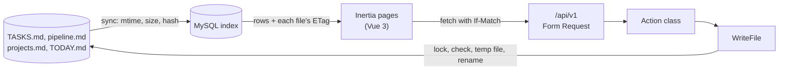

# Markboard

A local Laravel + Vue dashboard over plain-markdown project files.

Each project keeps its tasks in a `TASKS.md` file in a strict format, and a job search keeps its applications in a `pipeline.md` table. AI agents, scripts and editors change those files all day. Markboard lists every project in priority order, shows one project's tasks as the file groups them, shows the pipeline as a board and the daily brief, and lets you add, edit, tick, move and reorder tasks in the browser.

The files stay the source of truth. Markboard copies them into MySQL so it can filter and search, and writes each edit back to the file, changing only the lines of the task or row being edited, so a `git diff` of the file shows only that change. If the file changed on disk since the page was loaded, nothing is written: the edit becomes a conflict you can see, apply or discard.

Stack: PHP 8.5, Laravel 13, Inertia 3, Vue 3 with TypeScript, MySQL 8.4 through Laravel Sail, Pest, Larastan, Pint. It runs on localhost only and has no auth.

## Run it

You need Docker. The app starts on a made-up demo hub, so there is nothing to configure.

```sh
git clone https://github.com/kaiyiwong/markboard.git
cd markboard

# Install the PHP dependencies, which include Sail (skip with PHP and Composer installed: composer install)
docker run --rm -u "$(id -u):$(id -g)" -v "$(pwd):/var/www/html" -w /var/www/html \
    laravelsail/php84-composer:latest composer install --ignore-platform-reqs

cp .env.example .env
./vendor/bin/sail up -d --wait
./vendor/bin/sail artisan key:generate
./vendor/bin/sail artisan migrate
./vendor/bin/sail npm ci
./vendor/bin/sail npm run build
```

Open <http://localhost>. Every published port binds to `127.0.0.1`, so the app can't be reached from the network. If port 80 is taken, set `APP_PORT` in `.env` and run `sail up -d` again.

If `migrate` says `Access denied for user 'sail'`, MySQL first started with other `DB_*` settings: it creates its user and database only on an empty volume. Run `./vendor/bin/sail down -v` (this deletes the app's database, which sync rebuilds from the files) and start again from `sail up`.

Pages sync the files on every request, so the scheduler is optional. To keep search current while no page is open, run `./vendor/bin/sail artisan schedule:work` in a second terminal.

### The demo hub

With `MARKBOARD_HUB_PATH` unset, the app copies `demo/` to `storage/app/demo-hub/` on first use and works on that copy, so editing the demo never changes tracked files. The demo has seven made-up projects: a personal site, a client project with an overdue and a due-soon task, a product with tasks in every section, a paused game, a job search with a pipeline, one whose `TASKS.md` has format errors (shown read-only, with its errors and line numbers) and one with no `TASKS.md` at all.

To start the demo again from scratch:

```sh
./vendor/bin/sail artisan markboard:demo --reset
```

To see a conflict, open a project and choose Edit on one of its tasks. While the form is open, change that project's `TASKS.md` under `storage/app/demo-hub/projects/` in an editor, then save the form. An open form keeps the hash of the file it was opened on, so the save is refused and the conflict panel shows what changed.

### Your own hub

A hub is a folder holding `projects.md` (the registry), `priorities.md`, `TODAY.md`, `briefs/` and `scripts/check-tasks.py`; each registered project's folder holds its `TASKS.md`. [docs/spec.md](docs/spec.md) defines every file. Add to `.env`:

```sh
MARKBOARD_PROJECTS_ROOT=/Users/you/projects    # mounted into Sail at the same path
MARKBOARD_HUB_PATH=/Users/you/projects/hub      # must be inside MARKBOARD_PROJECTS_ROOT
MARKBOARD_TIMEZONE=Europe/London                # defines "today" for the dates the app writes
```

Then run `./vendor/bin/sail up -d` to mount the folder. The folder is mounted at the same path inside the container, so the registry's absolute paths work unchanged. Every `TASKS.md` write must pass the hub's own `scripts/check-tasks.py`; a hub without one refuses every task edit (the demo uses the copy in `resources/checker/`).

## Checks

The tests need PHP 8.5, Composer and Python 3, and no Docker or environment file: they run on in-memory SQLite locally and on MySQL in CI.

```sh
composer install
php artisan test        # Pest
composer lint           # Pint
composer analyse        # Larastan, level 6
npm ci
npm run typecheck       # vue-tsc
npm run build
```

## How it works



**Reading.** Middleware syncs the hub before every request: a file whose mtime and size are unchanged costs one `stat`; a changed one is hashed, parsed and its rows replaced in one transaction. Open pages poll every 15 seconds and when the window regains focus. Each page gets the rows and the hash of every file it shows, read in one transaction so the hash always describes the rows.

**Writing.** An edit is a request to the versioned JSON API with `If-Match: "<hash of the file the page showed>"`. A Form Request validates it, one action class per operation builds the change, and `app/Actions/WriteFile.php` writes it:

1. Take a lock on the file's real path.
2. Hash the file. If it isn't the `If-Match` hash, stop: record a conflict and answer `412` with the current task and a line diff.
3. Apply the edit as line operations on the original lines; every other line keeps its exact bytes, line ending included.
4. Parse the result again, and run the hub's `check-tasks.py` on it. A file the checker would reject is never written.
5. Write to a temp file next to the original, hash the original again, and rename the temp file over it.
6. Re-sync the file and answer `200` with the new `ETag`.

Other programs can't be made to take the lock, so a save landing between the second hash and the rename (microseconds) could still be lost. The design detects conflicts rather than claiming to prevent them, and says so.

| Path | What's there |
|---|---|
| [`app/Markdown/`](app/Markdown) | Parsers and writers for `TASKS.md`, `pipeline.md` and the registry. Plain PHP with no Laravel dependency, unit-tested without booting the app. |
| [`app/Sync/`](app/Sync) | The hub, the demo copy and sync into MySQL |
| [`app/Actions/`](app/Actions) | One class per write (add, edit, move, reorder, tick, cancel, undo, pipeline rows, apply and discard a conflict) and the shared write path |
| [`app/Http/`](app/Http) | Thin Inertia page controllers, `/api/v1` controllers, Form Requests and API Resources |
| [`resources/js/`](resources/js) | Vue pages and components, a typed `fetch` wrapper, response types |
| [`demo/`](demo) | The made-up hub, also the fixture for every feature test |
| [`docs/`](docs) | The spec, the design decisions, and each task's verification |

## Design decisions

The full list, with what each was weighed against, is in [docs/decisions.md](docs/decisions.md).

- **The files are the source of truth** (D13). The database is an index that can be dropped and rebuilt with `php artisan markboard:sync --fresh`. Sync replaces a changed file's rows and never merges.
- **A conflict is checked against the whole file** (D2). Any change on disk refuses the edit, using standard HTTP: `ETag`, `If-Match`, `412`, `428`. The conflict panel offers to apply the edit to the new version only when that task's own lines are unchanged, and only as an explicit click.
- **Writes never re-render the file** (D22). An edit replaces, removes or inserts whole lines; round-trip tests prove that every fixture parses and writes back to identical bytes.
- **The hub's checker has the final say** (D5). Every `TASKS.md` write must pass the same `check-tasks.py` the hub's other tools use, and parity tests keep the PHP parser's errors identical to the checker's, line and message, on every fixture and demo file.
- **Files with format errors are read-only** (D6), shown with their errors and the tasks that could be read.
- **No optimistic updates** (D11). After a write the page reloads its props, so the screen never shows a change the file didn't take.
- **Polling, not WebSockets** (D12). Sync costs a `stat` per file, so a 15-second poll is cheap; push would add a file watcher and Reverb.
- **One endpoint per operation** (D10): `/tick`, `/move`, `/undo` and the rest mirror what happens to the file, instead of one overloaded `PATCH`.

## Tests

- **Unit**: the parsers and writers against small fixtures in `tests/Fixtures/` (CRLF, mixed and unusual line breaks, no final newline, padded IDs, titles with parentheses, repeated metadata keys, each pipeline format error). Every fixture round-trips to identical bytes, every operation touches only the expected lines and passes the checker, and every input rule has a test.
- **Parity**: the PHP parser reports the same format errors as `check-tasks.py` on every fixture and every demo `TASKS.md`. With `MARKBOARD_HUB_PATH` set locally, it also runs over every `TASKS.md` in that hub.
- **Feature**: each on its own temp copy of `demo/`: sync, each page's Inertia props, every API endpoint and status code, apply and discard, and the demo copy.
- **Concurrency**: a test hook changes the file between building the edit and the second hash, and the test checks that nothing is written and a conflict is recorded.

## How this was built

Markboard was built with [Claude Code](https://claude.com/claude-code) under a spec, review and verify workflow. The author set the design in a recorded review ([docs/decisions.md](docs/decisions.md)) and the spec was written from it and reviewed before any feature code ([docs/spec-review.md](docs/spec-review.md)). Each task was then built against its proof line in `TASKS.md`, checked by a separate verifier ([docs/verify/](docs/verify)), and reviewed by the author before merging.

All the data in this repository is made up.

## License

MIT, see [LICENSE](LICENSE). The fonts in `design-system/fonts/` keep their own SIL Open Font License.
